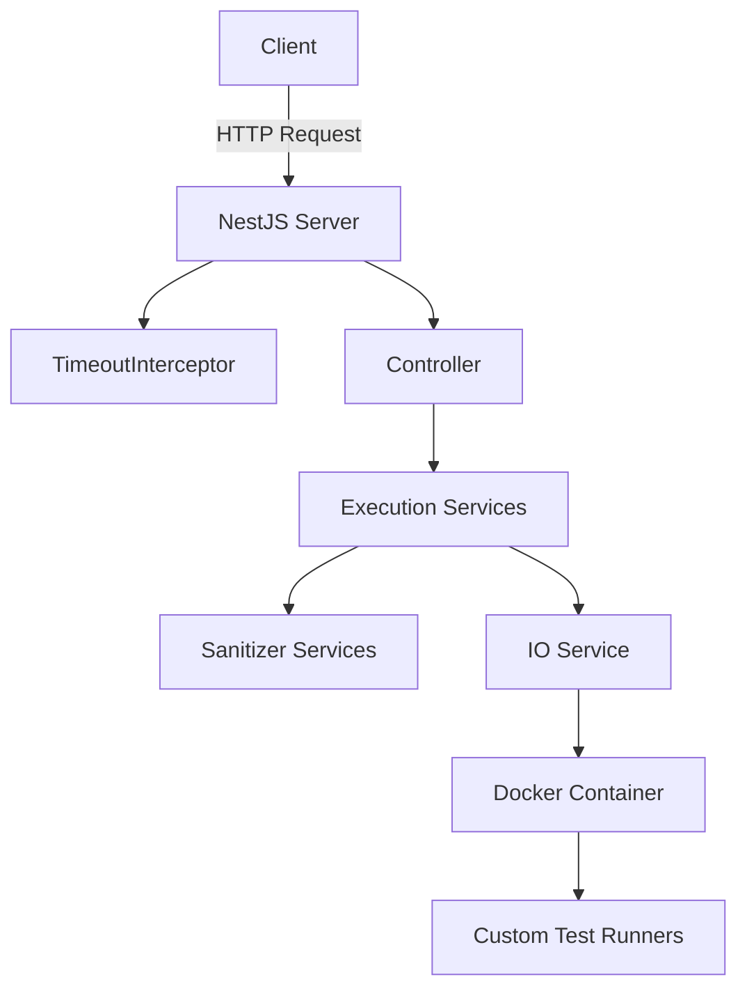
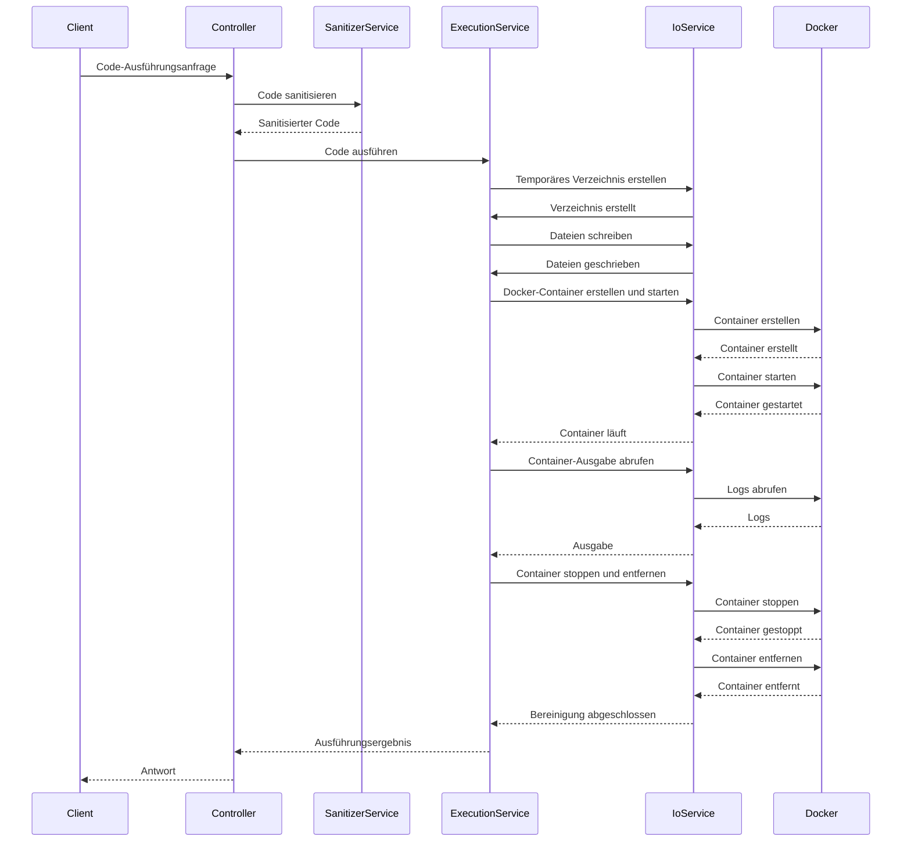
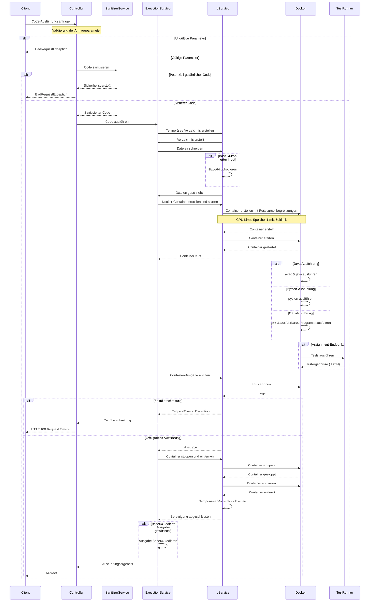

# Jury1 - Entwicklerdokumentation

Diese Dokumentation bietet einen umfassenden Überblick über das Jury1-Projekt und soll neuen Entwicklern helfen, sich schnell einzuarbeiten.

## Inhaltsverzeichnis

- [Einführung](#einführung)
- [Schnellstart](#schnellstart)
- [Architekturübersicht](#architekturübersicht)
- [Hauptkomponenten](#hauptkomponenten)
- [Workflow](#workflow)
- [API-Referenz](#api-referenz)
- [Sicherheitskonzepte](#sicherheitskonzepte)
- [Konfiguration](#konfiguration)
- [Entwicklungsrichtlinien](#entwicklungsrichtlinien)
- [Fehlerbehebung](#fehlerbehebung)

## Einführung

Jury1 ist ein NestJS-basierter Dienst, der die sichere Ausführung von Studentencode in Java, Python und C++ ermöglicht. Der Code wird in isolierten Docker-Containern ausgeführt, was eine sichere Sandbox-Umgebung gewährleistet.

### Hauptfunktionen

- **Sichere Code-Ausführung**: Ausführung von Code in isolierten Docker-Containern
- **Code-Sanitisierung**: Überprüfung des Codes auf potenziell gefährliche Operationen
- **Unterstützung für mehrere Programmiersprachen**: Java, Python und C++
- **Unterstützung für Einzeldateien und Projekte**: Ausführung von einzelnen Dateien oder mehreren Dateien als Projekt
- **Testausführung**: Ausführung von Tests für Studentenaufgaben und Rückgabe der Testergebnisse
- **Zeitbegrenzung**: Begrenzung der Ausführungszeit für Code

## Schnellstart

### Voraussetzungen

- Node.js (Version 14 oder höher)
- Docker
- NestJS CLI

### Installation

1. **Repository klonen:**

   ```sh
   git clone https://github.com/tihadot/jury1/
   cd jury1/
   ```

2. **Abhängigkeiten installieren:**

   ```sh
   npm install
   ```

3. **Umgebungskonfiguration:**

   Erstelle eine `.env`-Datei basierend auf der `env.example`-Datei:

   ```sh
   cp env.example .env
   ```

   Passe die Werte in der `.env`-Datei nach Bedarf an.

4. **Docker-Images bauen:**

   ```sh
   # Java JUnit Image bauen
   cd Docker/java-junit
   docker build -t java-junit .
   
   # Python Unittest Image bauen
   cd ../python-unittest
   docker build -t python-unittest .
   
   # C++ Doctest Image bauen
   cd ../cpp-doctest
   docker build -t cpp-doctest .
   ```

5. **Anwendung starten:**

   ```sh
   npm run start
   ```

   Die Anwendung ist nun unter `http://localhost:3000` erreichbar.

## Architekturübersicht

Jury1 folgt einer modularen Architektur mit klarer Trennung der Verantwortlichkeiten:



### Technologie-Stack

- **Backend**: NestJS (Node.js Framework)
- **Container**: Docker
- **Testframeworks**:
  - Java: JUnit
  - Python: unittest
  - C++: doctest

## Hauptkomponenten

### NestJS Server

Der Hauptserver, der die API-Endpunkte bereitstellt. Die Anwendung ist in Module unterteilt, die jeweils für eine bestimmte Funktionalität verantwortlich sind.

**Hauptmodule:**
- `AppModule`: Das Hauptmodul der Anwendung
- `JavaExecutionModule`: Modul für die Java-Code-Ausführung
- `PythonExecutionModule`: Modul für die Python-Code-Ausführung
- `CppExecutionModule`: Modul für die C++-Code-Ausführung
- `JavaSanitizerModule`: Modul für die Java-Code-Sanitisierung
- `PythonSanitizerModule`: Modul für die Python-Code-Sanitisierung
- `IoModule`: Modul für Dateioperationen und Docker-Container-Management

### TimeoutInterceptor

Ein NestJS-Interceptor, der die Ausführungszeit für alle Anfragen begrenzt. Wenn eine Anfrage die konfigurierte Zeitbegrenzung überschreitet, wird eine `RequestTimeoutException` ausgelöst.

**Wichtige Dateien:**
- `src/timeout/timeout.interceptor.ts`

### Controller

Controller verarbeiten die API-Anfragen und leiten sie an die entsprechenden Services weiter.

**Wichtige Dateien:**
- `src/java-execution/java-execution.controller.ts`
- `src/python-execution/python-execution.controller.ts`
- `src/cpp-execution/cpp-execution.controller.ts`

### Execution Services

Services, die den Code in Docker-Containern ausführen. Jede Programmiersprache hat ihren eigenen Execution Service.

**Wichtige Dateien:**
- `src/java-execution/java-execution.service.ts`
- `src/python-execution/python-execution.service.ts`
- `src/cpp-execution/cpp-execution.service.ts`

### Sanitizer Services

Services, die den Code auf potenziell gefährliche Operationen überprüfen. Jede Programmiersprache hat ihren eigenen Sanitizer Service.

**Wichtige Dateien:**
- `src/java-sanitizer/java-sanitizer.service.ts`
- `src/python-sanitizer/python-sanitizer.service.ts`

### IO Service

Ein Service, der Dateioperationen und Docker-Container-Management verwaltet. Er wird von allen Execution Services verwendet.

**Wichtige Dateien:**
- `src/io/io.service.ts`

### Docker Container

Isolierte Umgebungen für die Code-Ausführung. Jede Programmiersprache hat ihr eigenes Docker-Image.

**Wichtige Dateien:**
- `Docker/java-junit/Dockerfile`
- `Docker/python-unittest/Dockerfile`
- `Docker/cpp-doctest/Dockerfile`

### Custom Test Runners

Benutzerdefinierte Test-Runner für die verschiedenen Programmiersprachen, die Testergebnisse in einem einheitlichen JSON-Format zurückgeben.

**Wichtige Dateien:**
- `CustomRunners/CustomTestExecutionListener/src/main/java/com/jury1/CustomTestExecutionListener.java`
- `CustomRunners/CustomTestRunner/json_test_runner.py`
- `CustomRunners/CustomReporter/JsonReporter.h`

## Workflow

Der typische Ablauf einer Code-Ausführung sieht wie folgt aus:



### Detaillierter Ausführungsablauf mit Fehlerbehandlung

Das folgende Diagramm zeigt einen detaillierteren Ausführungsablauf mit Fehlerbehandlung und sprachspezifischen Unterschieden:

> **Hinweis zur Mermaid-Syntax**: In Mermaid-Sequenzdiagrammen steht `alt` für "alternative" und kennzeichnet Verzweigungen im Ablauf (ähnlich wie if-else in der Programmierung). `Note over` wird für Anmerkungen verwendet.



### Ausführungsschritte im Detail

1. **Code-Sanitisierung**:
   - Der Code wird auf potenziell gefährliche Operationen überprüft
   - Bei gefährlichen Operationen wird eine Fehlermeldung zurückgegeben

2. **Temporäres Verzeichnis**:
   - Ein eindeutiges temporäres Verzeichnis wird für jede Ausführung erstellt
   - Der Code wird in dieses Verzeichnis geschrieben

3. **Docker-Container**:
   - Ein Docker-Container wird mit dem entsprechenden Image erstellt
   - Das temporäre Verzeichnis wird in den Container gemountet
   - Der Container wird mit Ressourcenbegrenzungen gestartet

4. **Code-Ausführung**:
   - Der Code wird im Container ausgeführt
   - Die Ausgabe wird erfasst

5. **Bereinigung**:
   - Der Container wird gestoppt und entfernt
   - Das temporäre Verzeichnis wird gelöscht

## API-Referenz

Das Projekt bietet verschiedene API-Endpunkte für die Ausführung von Code in verschiedenen Programmiersprachen. Detaillierte Beispiele und Anfrageparameter finden Sie in der Postman-Sammlung unter `postman/jury1.postman_collection.json`.

### Verfügbare Endpunkte

#### Java
- `POST /execute/java`: Führt eine einzelne Java-Datei aus
- `POST /execute/java-project`: Führt ein Java-Projekt mit mehreren Dateien aus
- `POST /execute/java-assignment`: Führt ein Java-Projekt mit Tests aus und gibt die Testergebnisse zurück

#### Python
- `POST /execute/python`: Führt eine einzelne Python-Datei aus
- `POST /execute/python-project`: Führt ein Python-Projekt mit mehreren Dateien aus
- `POST /execute/python-assignment`: Führt ein Python-Projekt mit Tests aus und gibt die Testergebnisse zurück

#### C++
- `POST /execute/cpp`: Führt eine einzelne C++-Datei aus
- `POST /execute/cpp-project`: Führt ein C++-Projekt mit mehreren Dateien aus
- `POST /execute/cpp-assignment`: Führt ein C++-Projekt mit Tests aus und gibt die Testergebnisse zurück

### Verwendung der API

Um die API zu testen, können Sie die Postman-Sammlung importieren und die vorkonfigurierten Anfragen verwenden. Die Sammlung enthält Beispiele für alle verfügbaren Endpunkte mit entsprechenden Anfrageparametern und Beispieldaten.

## Sicherheitskonzepte

Das System implementiert mehrere Sicherheitsmaßnahmen, um die sichere Ausführung von Code zu gewährleisten:

### Code-Sanitisierung

Jede Programmiersprache hat ihren eigenen Sanitizer Service, der den Code auf potenziell gefährliche Operationen überprüft:

#### Java-Sanitisierung
- Blockiert `Runtime.getRuntime().exec()` (Ausführung von Shell-Befehlen)
- Blockiert `System.exit` (Beenden des Systems)
- Blockiert `java.net` (Netzwerkoperationen)
- Blockiert `javax.script` (Script-Engine)

#### Python-Sanitisierung
- Blockiert `import os` (Betriebssystemzugriff)
- Blockiert `__import__` (Dynamisches Importieren von Modulen)
- Blockiert `exec()` (Ausführung von Code als String)
- Blockiert `eval()` (Auswertung von Ausdrücken)
- Blockiert `subprocess` (Ausführung von Unterprozessen)

### Docker-Container-Isolation

Der Code wird in isolierten Docker-Containern ausgeführt, was eine sichere Sandbox-Umgebung gewährleistet:

- Jede Ausführung erfolgt in einem eigenen Container
- Container werden nach der Ausführung gestoppt und entfernt
- Temporäre Verzeichnisse werden nach der Ausführung gelöscht

Das System unterstützt auch gVisor (runsc) als alternativen Container-Runtime für zusätzliche Isolation.

### Ressourcenbegrenzung

Um Denial-of-Service-Angriffe zu verhindern, werden Ressourcen für jeden Container begrenzt:

- **CPU-Limit**: Standardmäßig 0,8 Kerne (konfigurierbar über `CPU_LIMIT`)
- **Speicher-Limit**: Standardmäßig 1 GB (konfigurierbar über `MEMORY_LIMIT`)
- **Ausführungszeit-Limit**: Standardmäßig 10 Sekunden (konfigurierbar über `EXECUTION_TIME_LIMIT`)

## Konfiguration

Das System kann über Umgebungsvariablen in der `.env`-Datei konfiguriert werden:

### Docker-Konfiguration

- `DOCKER_RUNTIME`: Docker-Runtime (runc, runsc, runsc-debug)
- `DOCKER_IMAGE_PYTHON`: Docker-Image für Python (Standard: python:alpine)
- `DOCKER_IMAGE_PYTHON_UNITTEST`: Docker-Image für Python mit unittest (Standard: python-unittest)
- `DOCKER_IMAGE_JAVA`: Docker-Image für Java (Standard: eclipse-temurin:21-jdk-alpine)
- `DOCKER_IMAGE_JAVA_JUNIT`: Docker-Image für Java mit JUnit (Standard: java-junit)
- `DOCKER_IMAGE_CPP`: Docker-Image für C++ (Standard: cpp-doctest)
- `DOCKER_IMAGE_CPP_DOCTEST`: Docker-Image für C++ mit doctest (Standard: cpp-doctest)

### Ressourcenbegrenzung

- `CPU_LIMIT`: CPU-Limit für Container (Standard: 0.8)
- `MEMORY_LIMIT`: Speicher-Limit für Container (Standard: 1G)
- `EXECUTION_TIME_LIMIT`: Ausführungszeit-Limit für Container in Millisekunden (Standard: 10000)

### Logging

- `LOG_LEVEL`: Log-Level (error, warn, info, http, verbose, debug, silly)

## Entwicklungsrichtlinien

### Codestruktur

Das Projekt folgt der NestJS-Struktur mit Modulen, Controllern und Services:

- **Module**: Definieren die Struktur der Anwendung und importieren andere Module
- **Controller**: Verarbeiten HTTP-Anfragen und leiten sie an Services weiter
- **Services**: Enthalten die Geschäftslogik der Anwendung

### Neue Programmiersprache hinzufügen

Um Unterstützung für eine neue Programmiersprache hinzuzufügen, müssen folgende Komponenten erstellt werden:

1. **Execution Service**: Implementiert die Logik für die Ausführung von Code in der neuen Sprache
2. **Sanitizer Service**: Implementiert die Logik für die Sanitisierung von Code in der neuen Sprache
3. **Controller**: Implementiert die API-Endpunkte für die neue Sprache
4. **Docker-Image**: Erstellt ein Docker-Image für die neue Sprache
5. **Custom Test Runner**: Implementiert einen benutzerdefinierten Test-Runner für die neue Sprache

### Testen

Das Projekt verwendet Jest für Unit-Tests und E2E-Tests:

- **Unit-Tests**: Testen einzelne Komponenten isoliert
- **E2E-Tests**: Testen die gesamte Anwendung über die API

Um Tests auszuführen:

```sh
# Unit-Tests
npm run test

# E2E-Tests
npm run test:e2e
```

## Fehlerbehebung

### Häufige Probleme

#### Docker-Container werden nicht erstellt

- Stellen Sie sicher, dass Docker läuft
- Überprüfen Sie, ob die Docker-Images vorhanden sind
- Überprüfen Sie die Docker-Konfiguration in der `.env`-Datei

#### Code-Ausführung schlägt fehl

- Überprüfen Sie, ob der Code syntaktisch korrekt ist
- Überprüfen Sie, ob der Code potenziell gefährliche Operationen enthält
- Überprüfen Sie die Logs für weitere Informationen

#### Zeitüberschreitung bei der Code-Ausführung

- Erhöhen Sie das Ausführungszeit-Limit in der `.env`-Datei
- Überprüfen Sie, ob der Code Endlosschleifen enthält

#### Unterscheidung zwischen verschiedenen Timeout-Arten

- **Ausführungs-Timeout (HTTP 408)**: Wenn die Codeausführung das konfigurierte Zeitlimit überschreitet, sendet der Server einen HTTP 408 Request Timeout mit der Nachricht "The execution exceeded the allowed time limit."
- **Server nicht erreichbar**: Wenn der Server nicht erreichbar ist, erhält der Client einen Netzwerkfehler (z.B. "Connection refused" oder "Connection timed out") und keinen HTTP-Statuscode

### Logging

Das System verwendet Winston für Logging. Die Logs werden in der Konsole und in Dateien unter `logs/` gespeichert.

Um das Log-Level zu ändern, setzen Sie die `LOG_LEVEL`-Umgebungsvariable in der `.env`-Datei.

### Debugging

Für das Debugging können Sie:

1. Das Log-Level auf `debug` oder `verbose` setzen
2. Die Docker-Container manuell inspizieren
3. Die temporären Verzeichnisse vor der Löschung inspizieren (durch Kommentieren der entsprechenden Zeilen im Code)

---

Diese Dokumentation bietet einen umfassenden Überblick über das Jury1-Projekt. Für weitere Informationen oder bei Fragen wenden Sie sich bitte an den Projektbetreuer.
