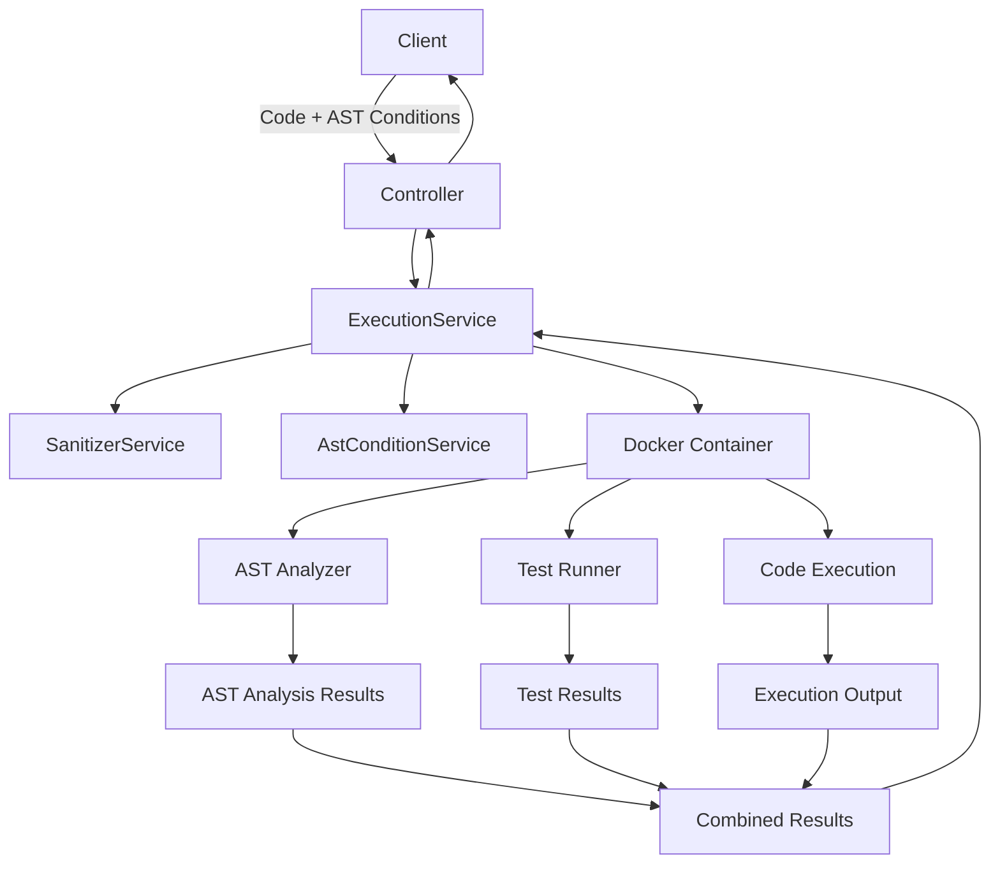

# Implementierungsplan: AST-Analyse für Jury1

Dieses Dokument beschreibt detailliert die Implementierung einer Abstract Syntax Tree (AST) Analysefunktion für das Jury1-System. Die Funktion ermöglicht es Lehrkräften, Bedingungen zu definieren, die der AST des Studentencodes erfüllen muss, wie z.B. die Verwendung von Rekursion oder bestimmten Datentypen.

## Inhaltsverzeichnis

- [Implementierungsplan: AST-Analyse für Jury1](#implementierungsplan-ast-analyse-für-jury1)
  - [Inhaltsverzeichnis](#inhaltsverzeichnis)
  - [1. Überblick und Anforderungen](#1-überblick-und-anforderungen)
    - [1.1 Ziel](#11-ziel)
    - [1.2 Hauptanforderungen](#12-hauptanforderungen)
    - [1.3 Nicht-funktionale Anforderungen](#13-nicht-funktionale-anforderungen)
  - [2. Architektur](#2-architektur)
    - [2.1 Architekturdiagramm](#21-architekturdiagramm)
    - [2.2 Komponenten](#22-komponenten)
  - [3. Backend-Implementierung](#3-backend-implementierung)
    - [3.1 Gemeinsame Komponenten](#31-gemeinsame-komponenten)
      - [3.1.1 AstCondition-Modell](#311-astcondition-modell)
      - [3.1.2 AstConditionService](#312-astconditionservice)
      - [3.1.3 AstConditionModule](#313-astconditionmodule)
    - [3.2 Python-Implementierung](#32-python-implementierung)
      - [3.2.1 Python AST-Analyzer-Skript](#321-python-ast-analyzer-skript)
      - [3.2.2 Aktualisierung des Python-Execution-Service](#322-aktualisierung-des-python-execution-service)
    - [3.3 Java-Implementierung](#33-java-implementierung)
      - [3.3.1 Java AST-Analyzer](#331-java-ast-analyzer)
      - [3.3.2 Aktualisierung des Java-Execution-Service](#332-aktualisierung-des-java-execution-service)
    - [3.4 C++-Implementierung](#34-c-implementierung)
      - [3.4.1 C++ AST-Analyzer](#341-c-ast-analyzer)
      - [3.4.2 Aktualisierung des C++-Execution-Service](#342-aktualisierung-des-c-execution-service)
  - [4. API-Erweiterungen](#4-api-erweiterungen)
    - [4.1 Controller-Erweiterungen](#41-controller-erweiterungen)
    - [4.2 DTO-Erweiterungen](#42-dto-erweiterungen)
    - [4.3 Swagger-Dokumentation](#43-swagger-dokumentation)
  - [5. Container-Integration](#5-container-integration)
    - [5.1 Docker-Image-Anpassungen](#51-docker-image-anpassungen)
    - [5.2 Container-Ausführungslogik](#52-container-ausführungslogik)
  - [6. Frontend-Komponenten](#6-frontend-komponenten)
    - [6.1 Bedingungseditor](#61-bedingungseditor)
    - [6.2 Ergebnisanzeige](#62-ergebnisanzeige)
  - [7. Teststrategien](#7-teststrategien)
    - [7.1 Unit-Tests](#71-unit-tests)
    - [7.2 Integrationstests](#72-integrationstests)
    - [7.3 End-to-End-Tests](#73-end-to-end-tests)
  - [8. Deployment](#8-deployment)
    - [8.1 Abhängigkeiten](#81-abhängigkeiten)
    - [8.2 Deployment-Schritte](#82-deployment-schritte)
  - [9. Dokumentation](#9-dokumentation)
    - [9.1 Entwicklerdokumentation](#91-entwicklerdokumentation)
    - [9.2 Benutzerdokumentation](#92-benutzerdokumentation)
  - [10. Erweiterungsmöglichkeiten](#10-erweiterungsmöglichkeiten)
    - [10.1 Neue Bedingungstypen](#101-neue-bedingungstypen)
    - [10.2 Unterstützung für weitere Sprachen](#102-unterstützung-für-weitere-sprachen)
    - [10.3 Erweiterte Analysefunktionen](#103-erweiterte-analysefunktionen)

## 1. Überblick und Anforderungen

### 1.1 Ziel

Entwicklung einer Funktion zur Analyse des Abstract Syntax Tree (AST) von Studentencode in Python, Java und C++, die es Lehrkräften ermöglicht, Bedingungen zu definieren, die der Code erfüllen muss.

### 1.2 Hauptanforderungen

- Unterstützung für Python, Java und C++
- Dynamische Definition von AST-Bedingungen durch Lehrkräfte
- Integration in den bestehenden Workflow von Jury1
- Überprüfung von Bedingungen wie:
  - Rekursive Implementierung von Funktionen
  - Verwendung bestimmter Datentypen
  - Verwendung spezifischer Sprachkonstrukte
  - Benutzerdefinierte Bedingungen
- Strukturierte Rückgabe der Analyseergebnisse
- Einfache Erweiterbarkeit für neue Bedingungstypen

### 1.3 Nicht-funktionale Anforderungen

- Minimaler Performance-Overhead (< 200ms pro Analyse)
- Skalierbarkeit für große Klassen und viele parallele Anfragen
- Robustheit gegenüber syntaktisch fehlerhaftem Code
- Benutzerfreundliche Definition von Bedingungen
- Klare, verständliche Fehlermeldungen für Studierende

## 2. Architektur

Die AST-Analyse wird als In-Container-Lösung implementiert, um die beste Performance und einfachste Integration zu gewährleisten.

### 2.1 Architekturdiagramm

### 2.2 Komponenten

1. **AstConditionService**: Validiert und verarbeitet AST-Bedingungen
2. **AST Analyzer Scripts**: Sprachspezifische Skripte zur AST-Analyse im Container
3. **API-Erweiterungen**: Erweiterungen der bestehenden API-Endpunkte
4. **Container-Integration**: Anpassungen der Docker-Container und Ausführungslogik
5. **Ergebnisverarbeitung**: Kombination von AST-Analyseergebnissen mit Testergebnissen

## 3. Backend-Implementierung

### 3.1 Gemeinsame Komponenten

#### 3.1.1 AstCondition-Modell

Erstellen Sie ein gemeinsames Modell für AST-Bedingungen mit folgenden Schnittstellen:

- **AstCondition**: Definiert eine AST-Bedingung mit Typ, Parametern, Nachricht und Erforderlichkeit
- **AstConditionResult**: Repräsentiert das Ergebnis einer AST-Bedingungsprüfung
- **AstAnalysisResult**: Fasst alle Bedingungsergebnisse zusammen

#### 3.1.2 AstConditionService

Erstellen Sie einen Service zur Validierung und Verarbeitung von AST-Bedingungen mit folgenden Funktionen:

- **validateConditions**: Validiert die übergebenen AST-Bedingungen
  - Prüft, ob die Bedingungen ein Array sind
  - Prüft, ob jede Bedingung einen Typ und eine Nachricht hat
  - Validiert spezifische Bedingungstypen (z.B. Rekursion, Datentyp)

- **validateConditionType**: Validiert eine spezifische Bedingung basierend auf ihrem Typ
  - Prüft typspezifische Parameter (z.B. Funktionsname für Rekursion)
  - Unterstützt verschiedene Bedingungstypen wie:
    - common.recursion
    - common.dataType
    - Sprachspezifische Typen (python.forLoop, java.streamApi, cpp.templateUsage)
    - custom (für benutzerdefinierte Bedingungen)

- **serializeConditions**: Serialisiert AST-Bedingungen für die Übergabe an Container
- **deserializeResults**: Deserialisiert AST-Analyseergebnisse aus dem Container

#### 3.1.3 AstConditionModule

Erstellen Sie ein NestJS-Modul für die AST-Bedingungen, das den AstConditionService bereitstellt und exportiert.

### 3.2 Python-Implementierung

#### 3.2.1 Python AST-Analyzer-Skript

Erstellen Sie ein Python-Skript zur AST-Analyse mit folgenden Funktionen:

- **Initialisierung**: Registrierung von Bedingungsprüfern für verschiedene Bedingungstypen
  - common.recursion
  - common.dataType
  - python.forLoop
  - python.whileLoop
  - python.listComprehension
  - python.functionCall
  - python.import
  - custom

- **Hauptanalyse-Funktion**: Analysiert Python-Code gegen AST-Bedingungen
  - Liest den Code aus einer Datei
  - Liest Bedingungen aus einer JSON-Datei
  - Parst den AST mit dem Python ast-Modul
  - Prüft jede Bedingung mit dem entsprechenden Prüfer
  - Bestimmt das Gesamtergebnis
  - Schreibt die Ergebnisse in eine Ausgabedatei

- **Bedingungsprüfer**: Implementierung für jede unterstützte Bedingung
  - **check_recursion**: Prüft, ob eine Funktion sich selbst rekursiv aufruft
  - **check_data_type**: Prüft, ob ein bestimmter Datentyp verwendet wird
  - **check_for_loop**: Prüft, ob For-Schleifen verwendet werden
  - **check_while_loop**: Prüft, ob While-Schleifen verwendet werden
  - **check_list_comprehension**: Prüft, ob List Comprehensions verwendet werden
  - **check_function_call**: Prüft, ob eine bestimmte Funktion aufgerufen wird
  - **check_import**: Prüft, ob ein bestimmtes Modul importiert wird
  - **check_custom**: Führt eine benutzerdefinierte Bedingungsprüfung aus

#### 3.2.2 Aktualisierung des Python-Execution-Service

Erweitern Sie den Python-Execution-Service um AST-Bedingungen mit folgenden Änderungen:

- **Konstruktor-Erweiterung**: Fügen Sie den AstConditionService als Abhängigkeit hinzu

- **runPythonAssignment-Methode erweitern**: 
  - Akzeptieren Sie AST-Bedingungen als zusätzlichen Parameter
  - Validieren Sie die AST-Bedingungen mit dem AstConditionService
  - Speichern Sie die AST-Bedingungen in einer JSON-Datei im temporären Verzeichnis
  - Erweitern Sie das Container-Kommando um die AST-Analyse
  - Lesen Sie die AST-Analyseergebnisse aus der Ergebnisdatei
  - Integrieren Sie die AST-Ergebnisse in die Rückgabe
  - Berechnen Sie die Gesamtpunktzahl als gewichteten Durchschnitt aus Tests und AST-Bedingungen

- **Rückgabetyp erweitern**: Fügen Sie AST-bezogene Felder hinzu
  - astResults: Die Ergebnisse der AST-Analyse
  - astConditionsPassed: Ob alle erforderlichen AST-Bedingungen erfüllt wurden

### 3.3 Java-Implementierung

#### 3.3.1 Java AST-Analyzer

Erstellen Sie einen Java-AST-Analyzer mit folgenden Funktionen:

- **Initialisierung**: Registrierung von Bedingungsprüfern für verschiedene Bedingungstypen
  - common.recursion
  - common.dataType
  - java.streamApi
  - java.lambda
  - java.forLoop
  - java.whileLoop
  - java.tryCatch
  - custom

- **Hauptanalyse-Funktion**: Analysiert Java-Code gegen AST-Bedingungen
  - Liest den Code aus einer Datei
  - Liest Bedingungen aus einer JSON-Datei
  - Parst den AST mit JavaParser
  - Prüft jede Bedingung mit dem entsprechenden Prüfer
  - Bestimmt das Gesamtergebnis
  - Schreibt die Ergebnisse in eine Ausgabedatei

- **Bedingungsprüfer**: Implementierung für jede unterstützte Bedingung
  - **checkRecursion**: Prüft, ob eine Methode sich selbst rekursiv aufruft
  - **checkDataType**: Prüft, ob ein bestimmter Datentyp verwendet wird
  - **checkStreamApi**: Prüft, ob die Stream API verwendet wird
  - **checkLambda**: Prüft, ob Lambda-Ausdrücke verwendet werden
  - **checkForLoop**: Prüft, ob For-Schleifen verwendet werden
  - **checkWhileLoop**: Prüft, ob While-Schleifen verwendet werden
  - **checkTryCatch**: Prüft, ob Try-Catch-Blöcke verwendet werden
  - **checkCustom**: Führt eine benutzerdefinierte Bedingungsprüfung aus

#### 3.3.2 Aktualisierung des Java-Execution-Service

Erweitern Sie den Java-Execution-Service um AST-Bedingungen mit folgenden Änderungen:

- **Konstruktor-Erweiterung**: Fügen Sie den AstConditionService als Abhängigkeit hinzu

- **runJavaAssignment-Methode erweitern**: 
  - Akzeptieren Sie AST-Bedingungen als zusätzlichen Parameter
  - Validieren Sie die AST-Bedingungen mit dem AstConditionService
  - Speichern Sie die AST-Bedingungen in einer JSON-Datei im temporären Verzeichnis
  - Erweitern Sie das Container-Kommando um die AST-Analyse
  - Lesen Sie die AST-Analyseergebnisse aus der Ergebnisdatei
  - Integrieren Sie die AST-Ergebnisse in die Rückgabe
  - Berechnen Sie die Gesamtpunktzahl als gewichteten Durchschnitt aus Tests und AST-Bedingungen

- **Rückgabetyp erweitern**: Fügen Sie AST-bezogene Felder hinzu
  - astResults: Die Ergebnisse der AST-Analyse
  - astConditionsPassed: Ob alle erforderlichen AST-Bedingungen erfüllt wurden

### 3.4 C++-Implementierung

#### 3.4.1 C++ AST-Analyzer

Erstellen Sie einen C++-AST-Analyzer mit folgenden Funktionen:

- **Initialisierung**: Registrierung von Bedingungsprüfern für verschiedene Bedingungstypen
  - common.recursion
  - common.dataType
  - cpp.templateUsage
  - cpp.forLoop
  - cpp.whileLoop
  - cpp.pointerUsage
  - cpp.classDefinition
  - custom

- **Hauptanalyse-Funktion**: Analysiert C++-Code gegen AST-Bedingungen
  - Liest den Code aus einer Datei
  - Liest Bedingungen aus einer JSON-Datei
  - Parst den AST mit Clang LibTooling
  - Prüft jede Bedingung mit dem entsprechenden Prüfer
  - Bestimmt das Gesamtergebnis
  - Schreibt die Ergebnisse in eine Ausgabedatei

- **Bedingungsprüfer**: Implementierung für jede unterstützte Bedingung
  - **checkRecursion**: Prüft, ob eine Funktion sich selbst rekursiv aufruft
  - **checkDataType**: Prüft, ob ein bestimmter Datentyp verwendet wird
  - **checkTemplateUsage**: Prüft, ob Templates verwendet werden
  - **checkForLoop**: Prüft, ob For-Schleifen verwendet werden
  - **checkWhileLoop**: Prüft, ob While-Schleifen verwendet werden
  - **checkPointerUsage**: Prüft, ob Pointer verwendet werden
  - **checkClassDefinition**: Prüft, ob Klassen definiert werden
  - **checkCustom**: Führt eine benutzerdefinierte Bedingungsprüfung aus

#### 3.4.2 Aktualisierung des C++-Execution-Service

Erweitern Sie den C++-Execution-Service um AST-Bedingungen mit folgenden Änderungen:

- **Konstruktor-Erweiterung**: Fügen Sie den AstConditionService als Abhängigkeit hinzu

- **runCppAssignment-Methode erweitern**: 
  - Akzeptieren Sie AST-Bedingungen als zusätzlichen Parameter
  - Validieren Sie die AST-Bedingungen mit dem AstConditionService
  - Speichern Sie die AST-Bedingungen in einer JSON-Datei im temporären Verzeichnis
  - Erweitern Sie das Container-Kommando um die AST-Analyse
  - Lesen Sie die AST-Analyseergebnisse aus der Ergebnisdatei
  - Integrieren Sie die AST-Ergebnisse in die Rückgabe
  - Berechnen Sie die Gesamtpunktzahl als gewichteten Durchschnitt aus Tests und AST-Bedingungen

- **Rückgabetyp erweitern**: Fügen Sie AST-bezogene Felder hinzu
  - astResults: Die Ergebnisse der AST-Analyse
  - astConditionsPassed: Ob alle erforderlichen AST-Bedingungen erfüllt wurden

## 4. API-Erweiterungen

### 4.1 Controller-Erweiterungen

Erweitern Sie die bestehenden Controller für Python, Java und C++ um AST-Bedingungen:

- **Aktualisieren Sie die Assignment-Endpunkte**: Erweitern Sie die Endpunkte für Python, Java und C++ um AST-Bedingungen
  - `/execute/python-assignment`
  - `/execute/java-assignment`
  - `/execute/cpp-assignment`

- **Aktualisieren Sie die Request-Body-Validierung**: Validieren Sie die AST-Bedingungen im Request-Body

- **Aktualisieren Sie die Response-Struktur**: Fügen Sie AST-Analyseergebnisse zur Response hinzu

### 4.2 DTO-Erweiterungen

Erstellen Sie neue DTOs (Data Transfer Objects) für AST-Bedingungen und -Ergebnisse:

- **AstConditionDto**: DTO für AST-Bedingungen
  - type: Der Typ der Bedingung
  - parameters: Die Parameter der Bedingung
  - message: Die Nachricht für die Bedingung
  - required: Ob die Bedingung erforderlich ist

- **AstConditionResultDto**: DTO für AST-Bedingungsergebnisse
  - condition: Die Nachricht der Bedingung
  - passed: Ob die Bedingung erfüllt wurde
  - details: Details zum Ergebnis

- **AssignmentResponseDto**: Erweitern Sie die bestehende DTO um AST-Analyseergebnisse
  - astResults: Die Ergebnisse der AST-Analyse
  - astConditionsPassed: Ob alle erforderlichen AST-Bedingungen erfüllt wurden

### 4.3 Swagger-Dokumentation

Aktualisieren Sie die Swagger-Dokumentation für die erweiterten API-Endpunkte:

- **Dokumentieren Sie die neuen Parameter**: Beschreiben Sie die AST-Bedingungen und ihre Parameter
- **Dokumentieren Sie die erweiterten Responses**: Beschreiben Sie die AST-Analyseergebnisse
- **Fügen Sie Beispiele hinzu**: Fügen Sie Beispiele für AST-Bedingungen und -Ergebnisse hinzu

## 5. Container-Integration

### 5.1 Docker-Image-Anpassungen

Aktualisieren Sie die Docker-Images für Python, Java und C++ um die AST-Analyse-Tools:

- **Python-Image**: Fügen Sie das Python-AST-Analyzer-Skript hinzu
  - Kopieren Sie das Skript in das Image
  - Installieren Sie benötigte Abhängigkeiten (ast-Modul ist in der Standardbibliothek enthalten)

- **Java-Image**: Fügen Sie den Java-AST-Analyzer hinzu
  - Kopieren Sie den Analyzer in das Image
  - Installieren Sie benötigte Abhängigkeiten (JavaParser, JSON-Bibliothek)

- **C++-Image**: Fügen Sie den C++-AST-Analyzer hinzu
  - Kopieren Sie den Analyzer in das Image
  - Installieren Sie benötigte Abhängigkeiten (Clang LibTooling, JSON-Bibliothek)

### 5.2 Container-Ausführungslogik

Aktualisieren Sie die Container-Ausführungslogik für die AST-Analyse:

- **Ausführungskommando erweitern**: Fügen Sie die AST-Analyse zum Ausführungskommando hinzu
  - Führen Sie die Tests aus
  - Führen Sie die AST-Analyse aus
  - Kombinieren Sie die Ergebnisse

- **Dateipfade definieren**: Definieren Sie Pfade für AST-Bedingungen und -Ergebnisse
  - AST-Bedingungen: `/usr/src/app/ast-conditions.json`
  - AST-Ergebnisse: `/usr/src/app/ast-results.json`

- **Fehlerbehandlung**: Behandeln Sie Fehler bei der AST-Analyse
  - Fangen Sie Fehler ab und schreiben Sie Fehlermeldungen in die Ergebnisdatei
  - Stellen Sie sicher, dass der Container auch bei Fehlern in der AST-Analyse beendet wird

## 6. Frontend-Komponenten

### 6.1 Bedingungseditor

Entwickeln Sie einen Bedingungseditor für Lehrkräfte:

- **Bedingungstypen-Auswahl**: Dropdown-Menü für verfügbare Bedingungstypen
  - Gemeinsame Bedingungen (Rekursion, Datentyp)
  - Sprachspezifische Bedingungen (Python, Java, C++)
  - Benutzerdefinierte Bedingungen

- **Parameter-Editor**: Formular für die Parameter der ausgewählten Bedingung
  - Dynamische Felder basierend auf dem Bedingungstyp
  - Validierung der Eingaben

- **Nachrichteneditor**: Textfeld für die Nachricht der Bedingung
  - Vorschläge für Standardnachrichten
  - Mehrsprachige Unterstützung

- **Erforderlichkeits-Toggle**: Checkbox für die Erforderlichkeit der Bedingung
  - Bestimmt, ob die Bedingung für das Bestehen erforderlich ist

- **Bedingungsliste**: Liste der definierten Bedingungen
  - Bearbeiten, Löschen und Neuordnen von Bedingungen
  - Import/Export von Bedingungen

### 6.2 Ergebnisanzeige

Entwickeln Sie eine Ergebnisanzeige für Studierende:

- **Testergebnisse**: Anzeige der Testergebnisse
  - Bestandene und fehlgeschlagene Tests
  - Fehlermeldungen für fehlgeschlagene Tests

- **AST-Analyseergebnisse**: Anzeige der AST-Analyseergebnisse
  - Erfüllte und nicht erfüllte Bedingungen
  - Hinweise zur Erfüllung der Bedingungen

- **Gesamtergebnis**: Anzeige des Gesamtergebnisses
  - Gesamtpunktzahl
  - Bestanden/Nicht bestanden
  - Feedback und Verbesserungsvorschläge

## 7. Teststrategien

### 7.1 Unit-Tests

Entwickeln Sie Unit-Tests für die AST-Analyse-Komponenten:

- **AstConditionService-Tests**: Testen Sie die Validierung und Verarbeitung von AST-Bedingungen
  - Validierung von gültigen und ungültigen Bedingungen
  - Serialisierung und Deserialisierung von Bedingungen und Ergebnissen

- **AST-Analyzer-Tests**: Testen Sie die AST-Analyzer-Skripte
  - Testen Sie jeden Bedingungsprüfer mit verschiedenen Eingaben
  - Testen Sie die Fehlerbehandlung

- **Execution-Service-Tests**: Testen Sie die erweiterten Execution-Services
  - Testen Sie die Integration der AST-Analyse
  - Testen Sie die Berechnung der Gesamtpunktzahl

### 7.2 Integrationstests

Entwickeln Sie Integrationstests für die AST-Analyse:

- **Controller-Tests**: Testen Sie die erweiterten Controller
  - Testen Sie die API-Endpunkte mit verschiedenen Eingaben
  - Testen Sie die Validierung und Fehlerbehandlung

- **Container-Tests**: Testen Sie die Container-Integration
  - Testen Sie die Ausführung der AST-Analyse in Containern
  - Testen Sie die Kombination von Testergebnissen und AST-Analyseergebnissen

### 7.3 End-to-End-Tests

Entwickeln Sie End-to-End-Tests für die AST-Analyse:

- **Workflow-Tests**: Testen Sie den gesamten Workflow
  - Testen Sie die Definition von AST-Bedingungen
  - Testen Sie die Ausführung von Code mit AST-Bedingungen
  - Testen Sie die Anzeige der Ergebnisse

- **Performance-Tests**: Testen Sie die Performance der AST-Analyse
  - Testen Sie die Ausführungszeit für verschiedene Codebeispiele
  - Testen Sie die Skalierbarkeit für große Klassen

## 8. Deployment

### 8.1 Abhängigkeiten

Definieren Sie die Abhängigkeiten für die AST-Analyse:

- **Backend-Abhängigkeiten**: Fügen Sie benötigte Abhängigkeiten zur package.json hinzu
  - NestJS-Module
  - Validierungsbibliotheken
  - JSON-Bibliotheken

- **Container-Abhängigkeiten**: Definieren Sie benötigte Abhängigkeiten in den Dockerfiles
  - Python: ast-Modul (Standardbibliothek)
  - Java: JavaParser, JSON-Bibliothek
  - C++: Clang LibTooling, JSON-Bibliothek

### 8.2 Deployment-Schritte

Definieren Sie die Schritte für das Deployment der AST-Analyse:

1. **Backend-Deployment**:
   - Aktualisieren Sie die Backend-Codebase
   - Installieren Sie neue Abhängigkeiten
   - Kompilieren Sie den TypeScript-Code
   - Starten Sie den NestJS-Server neu

2. **Container-Deployment**:
   - Bauen Sie die aktualisierten Docker-Images
   - Testen Sie die Images
   - Pushen Sie die Images in die Registry
   - Aktualisieren Sie die Container-Konfiguration

3. **Frontend-Deployment** (falls zutreffend):
   - Aktualisieren Sie die Frontend-Codebase
   - Installieren Sie neue Abhängigkeiten
   - Bauen Sie die Frontend-Assets
   - Deployen Sie die Assets

## 9. Dokumentation

### 9.1 Entwicklerdokumentation

Erstellen Sie eine Entwicklerdokumentation für die AST-Analyse:

- **Architekturübersicht**: Beschreiben Sie die Architektur der AST-Analyse
  - Komponenten und ihre Beziehungen
  - Datenfluss und Interaktionen

- **API-Dokumentation**: Dokumentieren Sie die API-Endpunkte
  - Parameter und Rückgabewerte
  - Beispielanfragen und -antworten

- **Codebeispiele**: Fügen Sie Codebeispiele für die Verwendung der AST-Analyse hinzu
  - Definition von AST-Bedingungen
  - Ausführung von Code mit AST-Bedingungen
  - Verarbeitung von AST-Analyseergebnissen

- **Erweiterungsanleitung**: Dokumentieren Sie, wie die AST-Analyse erweitert werden kann
  - Hinzufügen neuer Bedingungstypen
  - Unterstützung für weitere Sprachen
  - Anpassung der Analysefunktionen

### 9.2 Benutzerdokumentation

Erstellen Sie eine Benutzerdokumentation für die AST-Analyse:

- **Lehrkräfte-Anleitung**: Dokumentieren Sie die Verwendung der AST-Analyse für Lehrkräfte
  - Definition von AST-Bedingungen
  - Interpretation der Ergebnisse
  - Beispiele für häufige Anwendungsfälle

- **Studierende-Anleitung**: Dokumentieren Sie die Interpretation der AST-Analyseergebnisse für Studierende
  - Verständnis der Bedingungen
  - Behebung von nicht erfüllten Bedingungen
  - Beispiele für typische Fehler und deren Behebung

## 10. Erweiterungsmöglichkeiten

### 10.1 Neue Bedingungstypen

Beschreiben Sie, wie neue Bedingungstypen hinzugefügt werden können:

- **Gemeinsame Bedingungen**: Bedingungen, die für alle Sprachen gelten
  - Implementierung in allen Analyzern
  - Dokumentation der Parameter und Verwendung

- **Sprachspezifische Bedingungen**: Bedingungen, die nur für eine bestimmte Sprache gelten
  - Implementierung im entsprechenden Analyzer
  - Dokumentation der Parameter und Verwendung

- **Benutzerdefinierte Bedingungen**: Bedingungen, die von Lehrkräften definiert werden
  - Sicherheitsaspekte bei der Ausführung von benutzerdefiniertem Code
  - Einschränkungen und Best Practices

### 10.2 Unterstützung für weitere Sprachen

Beschreiben Sie, wie die AST-Analyse für weitere Programmiersprachen erweitert werden kann:

- **Neue Analyzer**: Implementierung von AST-Analyzern für weitere Sprachen
  - Auswahl geeigneter AST-Parser
  - Implementierung der Bedingungsprüfer
  - Integration in die Container-Ausführung

- **API-Erweiterungen**: Erweiterung der API für neue Sprachen
  - Neue Endpunkte
  - Dokumentation der Parameter und Rückgabewerte

- **Dokumentation**: Dokumentation der neuen Sprachen
  - Unterstützte Bedingungstypen
  - Beispiele für die Verwendung

### 10.3 Erweiterte Analysefunktionen

Beschreiben Sie mögliche Erweiterungen der AST-Analyse:

- **Komplexere Bedingungen**: Unterstützung für komplexere Bedingungen
  - Kombinationen von Bedingungen (UND, ODER, NICHT)
  - Bedingte Bedingungen (WENN-DANN)
  - Quantifizierte Bedingungen (MINDESTENS, HÖCHSTENS)

- **Statische Codeanalyse**: Integration von statischer Codeanalyse
  - Erkennung von Code-Smells
  - Überprüfung von Coding-Standards
  - Sicherheitsanalyse

- **Feedback-Generierung**: Automatische Generierung von Feedback
  - Vorschläge zur Verbesserung des Codes
  - Erklärungen zu nicht erfüllten Bedingungen
  - Beispiele für die Erfüllung von Bedingungen
